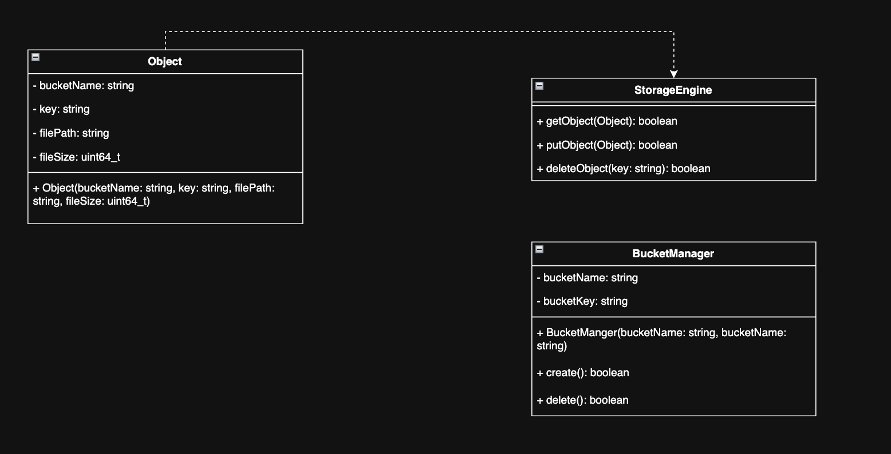

# OpenBucket

----
OpenBucket is object storage service stores, not file system.

### Key characteristics

---
- Stores objects (binary blobs + metadata)
- Objects live inside buckets
- Accessed via HTTP APIs

```arc
HTTP Request
   ↓
HTTP Server
   ↓
 Methods
   ↓
StorageEngine
   ↓
Filesystem
```

### UML Diagram

---

